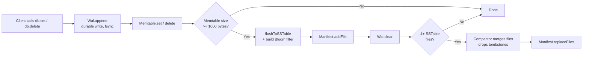
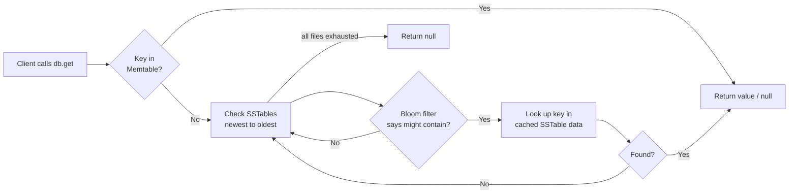
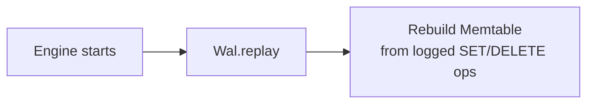

```
  ____ ____      _    ___ _   _ 
 / ___|  _ \    / \  |_ _| \ | |
| |  _| |_) |  / _ \  | ||  \| |
| |_| |  _ <  / ___ \ | || |\  |
 \____|_| \_\/_/   \_\___|_| \_|

LSM-Tree Key-Value storage engine
```

A small, functional Log-Structured Merge (LSM) Tree key-value storage engine, built from scratch in TypeScript.

Grain implements a complete storage lifecycle directly against the file system with zero external database dependencies. It features an in-memory write buffer, a Write-Ahead Log for crash recovery, immutable SSTables, Bloom filters for fast negative lookups, and background compaction.

This project was built to understand, at the implementation level, how modern key-value stores manage writes, durability, and disk storage.

---

## Table of Contents

- [Features](#features)
- [Architecture](#architecture)
- [Write Path](#write-path)
- [Read Path](#read-path)
- [Crash Recovery](#crash-recovery)
- [Project Structure](#project-structure)
- [Getting Started](#getting-started)
- [Tests](#tests)
- [Benchmarks](#benchmarks)
- [Design Decisions](#design-decisions)
- [Known Limitations and Future Work](#known-limitations-and-future-work)
- [License](#license)

---

## Features

| Component | Description |
|---|---|
| MemTable | In-memory sorted write buffer backed by a `Map`, holding the most recent writes |
| Write-Ahead Log (WAL) | Append-only, `fsync`-backed log written before every mutation, for durability |
| SSTables | Immutable, sorted on-disk segment files produced when the MemTable is flushed |
| Bloom Filter | Per-SSTable probabilistic filter that lets reads skip files that cannot contain a key |
| Manifest | Tracks which SSTable files currently exist, newest first |
| Compactor | Merges SSTable files once a threshold is reached, dropping tombstoned keys |
| In-memory read cache | Caches parsed SSTable contents and Bloom filters per file to avoid redundant disk reads |
| Crash recovery | Replays the WAL on startup to rebuild any MemTable state lost before a flush |

---

## Architecture

Grain follows the standard LSM-tree write/read split:

- **Writes** always go to the WAL first (durability), then to the MemTable (speed). Once the MemTable crosses a size threshold, it is flushed to an immutable SSTable file on disk, and the WAL is cleared.
- **Reads** check the MemTable first (freshest data), then fall back to SSTable files on disk, newest to oldest. A Bloom filter is checked before opening each file, so files that cannot contain the key are skipped without a disk read.
- **Compaction** runs automatically once enough SSTable files accumulate, merging them into a single file and permanently removing deleted (tombstoned) keys.

---

## Write Path



Every write is appended to the WAL and `fsync`ed to disk before the in-memory MemTable is touched. This ordering is what makes crash recovery possible — if the process dies mid-write, the WAL is the durable source of truth.

---

## Read Path



`readFromSSTable` first checks an in-memory-cached Bloom filter for the file. If the filter reports the key is definitely absent, the file is skipped with no disk access. Otherwise, the file's parsed contents (also cached after first access) are checked directly. This cache is what turned Grain's read throughput from roughly 96 reads/sec to over 126,000 reads/sec — see [Benchmarks](#benchmarks).

---

## Crash Recovery



On startup, the `Engine` constructor replays every operation in `wal.log` back into the MemTable before accepting new requests. Any writes that were `fsync`ed but never flushed to an SSTable are recovered this way.

---

## Project Structure

```
grain/
├── src/
│   ├── memtable/
│   │   └── memtable.ts        in-memory sorted map, tombstone deletes
│   ├── wal/
│   │   └── wal.ts              append-only write-ahead log, replay on startup
│   ├── manifest/
│   │   └── manifest.ts         tracks active SSTable files
│   ├── storage/
│   │   ├── sstable/
│   │   │   ├── writer.ts       flush Memtable to disk + build Bloom filter
│   │   │   └── reader.ts       cached SSTable + Bloom filter lookups
│   │   ├── bloomfilter.ts      probabilistic membership filter
│   │   └── compactor.ts        merges SSTables, drops tombstones
│   ├── engine.ts                public API — wires everything together
│   └── index.ts                  entry point / demo
├── examples/
│   ├── exampletest.ts           correctness tests
│   └── benchmark.ts             write/read throughput benchmark
├── data/                          WAL, SSTable, and manifest files (generated at runtime)
├── package.json
├── tsconfig.json
└── README.md
```

---

## Getting Started

### Prerequisites

- Node.js 18 or later
- npm

### Installation

```bash
git clone https://github.com/SupriyoP09/Grain.git
cd Grain
npm install
```

### Run

```bash
npx tsx src/index.ts
```

Expected output:

```
supriyo
null
```

The second line is `null` because the demo script deletes the `name` key immediately after reading it.

---

## Tests

Grain includes a small correctness suite covering the core guarantees of an LSM-tree engine: basic reads/writes, tombstone deletes, flush-to-disk durability, and WAL-based crash recovery.

```bash
npx tsx examples/exampletest.ts
```

```
Starting Grain Engine Tests...

✅ basic set/get
✅ delete returns null, not stale value
✅ missing key returns null
✅ value survives flush to SSTable
✅ WAL replay recovers unflushed writes

All tests completed!
```

---

## Benchmarks

```bash
npx tsx examples/benchmark.ts
```

Benchmark: 10,000 writes followed by 10,000 random-key reads.

| Metric | Before read cache | After read cache | Change |
|---|---|---|---|
| Writes | 601 writes/sec | 583 writes/sec | Unchanged (expected — see note below) |
| Reads | 96 reads/sec | 126,875 reads/sec | ~1,322x faster |

**Why writes did not change:** every write calls `fsync` before acknowledging, which blocks until the operating system confirms the WAL entry is physically on disk. This is the cost of real durability, not an inefficiency — removing it would make writes faster but unsafe against crashes, so it was left untouched.

**Why reads improved by three orders of magnitude:** the original `readFromSSTable` re-read and re-parsed both the `.bloom` file and the full SSTable file from disk on every single call, even for files it had already read moments earlier. An in-memory cache (keyed by file path, invalidated on compaction) now ensures each SSTable file and its Bloom filter are read from disk once, with all subsequent lookups served from memory.

---

## Design Decisions

- **WAL before MemTable, always.** Every `set`/`delete` writes to the WAL and `fsync`s before touching the in-memory store, guaranteeing no acknowledged write can be lost to a crash.
- **Tombstones over immediate deletion.** Deletes are recorded as `null` values rather than removed outright, so a delete correctly overrides an older value already flushed to an SSTable. Tombstones are only dropped permanently during compaction, once no older file can "resurrect" the key.
- **JSON Lines on-disk format.** SSTables and the WAL use newline-delimited JSON rather than a binary format. This trades some space and parse efficiency for readability and simplicity, which was the right tradeoff for a project focused on the LSM-tree mechanics rather than serialization performance.
- **Bloom filter per SSTable file.** Each flushed SSTable gets its own Bloom filter, avoiding a disk read entirely for files that cannot contain a given key.
- **In-memory caching over disk re-reads.** SSTable contents and Bloom filters are cached per file path after first access, since files are immutable once written — the only time a cache entry becomes stale is when compaction deletes the file, which explicitly invalidates the cache.

---

## Known Limitations and Future Work

- **No group commit.** Each write performs its own `fsync`, capping write throughput at roughly 600 writes/sec. Batching multiple writes into a single `fsync` (group commit) would improve this at the cost of added complexity.
- **No binary serialization.** SSTables and the WAL are stored as JSON Lines. A binary format with a fixed-size header, checksums, and a block index would reduce file size and parsing cost.
- **No sparse index or binary search.** SSTable lookups scan a fully parsed in-memory map rather than using a sparse index over sorted, block-based data — sufficient at the scale this engine is tested at, but not how production LSM engines handle very large files.
- **No range queries.** Only exact-key `get`/`set`/`delete` are supported; no iteration over key ranges.
- **Single-process only.** Grain is an embedded engine, not a server — there is no network protocol, concurrent client support, or replication. This is an intentional scope boundary, not a missing feature: those concerns belong in a separate, larger project.

---

## License

MIT — see [LICENSE](LICENSE) for details.